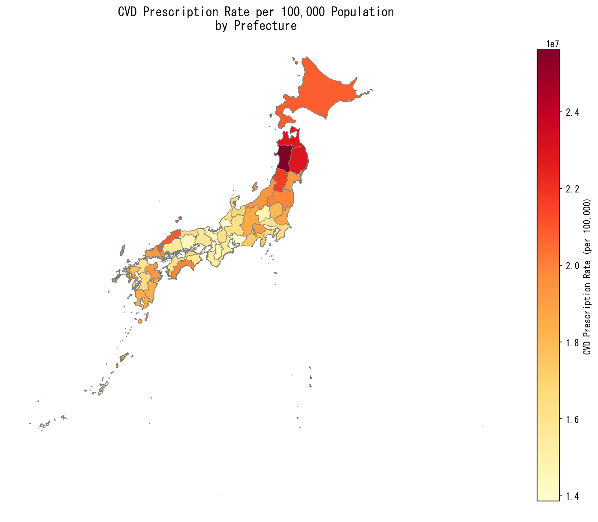
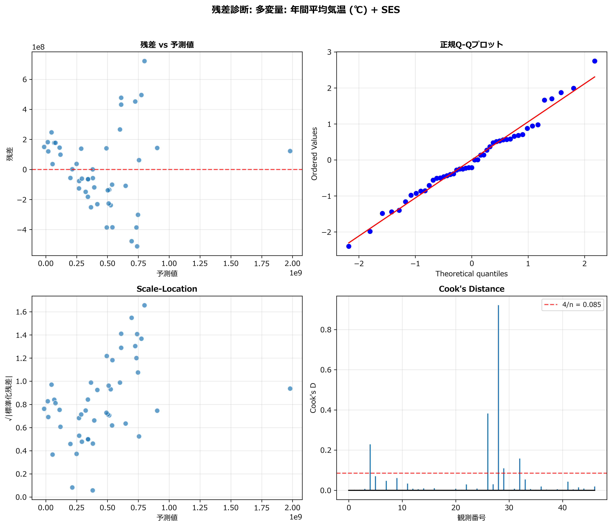

---

# Abstract

## Background

Cardiovascular diseases (CVDs) are the second leading cause of death in Japan, and ambient temperature is a recognized environmental risk factor. However, few studies have examined the association between cold climate exposure and CVD-related prescription rates at the population level using nationwide administrative data.

## Objective

We examined whether cold month exposure was associated with prefectural-level CVD prescription rates (per 100,000 population) across Japan, independent of socioeconomic confounders.

## Methods

We conducted a nationwide ecological study using 47 Japanese prefectures as the unit of analysis. CVD prescription rates (per 100,000 population) were derived from the 10th National Database (NDB) Open Data (fiscal year 2020) and standardized by 2020 National Census population. Cold month ratio (proportion of months with mean temperature <10°C) was calculated from Japan Meteorological Agency data. Covariates included physicians per 100,000, unemployment rate, aging rate, and per capita prefectural income. Multivariable ordinary least squares (OLS) regression was used. Spatial autocorrelation was assessed using Global Moran's I.

## Results

The mean CVD prescription rate across prefectures was 17,521,396 ± 2,607,830 per 100,000 population. Cold month ratio showed the strongest univariable association with CVD prescription rate (R² = 0.390, *p* < 0.001) among five temperature indicators. In the multivariable model (R² = 0.667, adjusted R² = 0.626), cold month ratio (β = +10,450,255; *p* < 0.001), aging rate (β = +499,769; *p* < 0.001), and unemployment rate (β = +1,300,753; *p* = 0.025) were independently and significantly associated with higher CVD prescription rates. Residual diagnostics confirmed model adequacy: no heteroscedasticity (Breusch-Pagan *p* = 0.633), normality of residuals (Shapiro-Wilk *p* = 0.107), and no autocorrelation (Durbin-Watson = 2.43). Global Moran's I was not significant (I = 0.091, *p* = 0.114), indicating that the per-capita CVD prescription rate did not exhibit spatial clustering after population standardization.

## Conclusions

Cold month exposure was independently and strongly associated with higher CVD prescription rates across Japanese prefectures, alongside aging rate and unemployment rate. These findings suggest that prefectures with prolonged cold seasons bear a disproportionate CVD pharmaceutical burden, warranting targeted seasonal prevention strategies and healthcare resource allocation.

**Keywords**: cold exposure; cardiovascular disease; prescription rate; ecological study; NDB Open Data; Japan

**Keywords:** ecological study; Japan; health insurance claims

---

# Introduction

Cardiovascular diseases (CVDs), including ischemic heart disease and cerebrovascular disease, remain the leading cause of mortality worldwide, accounting for approximately 19.8 million deaths in 2022.1) In Japan, CVDs represent the second leading cause of death after malignant neoplasms and impose a substantial economic burden on the healthcare system.2) Understanding environmental determinants of CVD burden at the population level is essential for informing public health prevention strategies and healthcare resource allocation.

Ambient temperature is a well-established risk factor for cardiovascular morbidity and mortality. Epidemiological studies have consistently demonstrated that cold exposure increases the risk of acute cardiovascular events, including myocardial infarction, stroke, and heart failure exacerbation.3), 4), 5) The physiological mechanisms are well characterized: cold exposure increases sympathetic nervous system activity, elevates blood pressure, increases blood viscosity, and promotes thrombogenesis.6), 7) A large multi-country study by Gasparrini et al. demonstrated that cold-related mortality substantially exceeded heat-related mortality in most temperate countries.8) Globally, Zhao et al. estimated that non-optimal ambient temperatures accounted for 5.08 million excess deaths annually during 2000–2019, with cold-related mortality predominating in temperate regions including East Asia.9)

However, the majority of studies on temperature and CVD have focused on acute clinical outcomes (emergency department visits, hospitalizations, mortality) at the individual level. The relationship between cumulative cold exposure and CVD-related drug prescription patterns—which reflects chronic disease management and ongoing healthcare utilization—has received limited attention. Drug prescription rates serve as a proxy indicator of CVD prevalence and treatment intensity at the population level, capturing not only acute disease burden but also the pharmacological management of chronic cardiovascular conditions such as hypertension, dyslipidemia, and heart failure.

Japan's archipelago spans approximately 25 degrees of latitude, from subarctic Hokkaido to subtropical Okinawa, with the proportion of cold months (mean monthly temperature <10°C) varying substantially across prefectures.10) This geographic gradient in cold exposure, combined with the availability of the National Database (NDB) Open Data—a comprehensive administrative database covering virtually all health insurance claims in Japan—offers a unique opportunity to examine the cold exposure–CVD prescription relationship at a nationwide ecological scale.

In this study, we examined whether cold month ratio was associated with prefectural-level CVD prescription rates (per 100,000 population) across Japan, independent of socioeconomic covariates, using multivariable regression. We also assessed spatial autocorrelation to determine whether CVD prescription patterns exhibited geographic clustering.

---

# Methods

## 1. Study Design

We conducted a nationwide ecological study in which the Japanese prefecture (N = 47) served as the unit of analysis. Prefecture-level aggregate data were used because individual-level geographic information is not available from NDB Open Data. The study period corresponded to fiscal year 2020 (April 2020 through March 2021).

## 2. Outcome: CVD Prescription Rate

CVD prescription volume (total quantity) was derived from the 10th NDB Open Data (released 2023), which contains prefecture-level counts of pharmaceutical prescriptions for cardiovascular-related drug categories claimed under the national health insurance system. Drug categories included antihypertensives, anticoagulants, vasodilators, antihyperlipidemic agents, and other cardiovascular drugs. Prescription rates were calculated per 100,000 population using the 2020 National Census population for each prefecture.

## 3. Exposure: Cold Month Ratio

Five temperature indicators were computed from Japan Meteorological Agency (JMA) monthly climate data for each prefecture: (1) mean annual temperature, (2) annual temperature range, (3) winter mean temperature (December–February), (4) temperature variability (standard deviation of monthly means), and (5) cold month ratio (proportion of months with mean temperature <10°C). The cold month ratio was selected as the primary exposure based on model fit (highest adjusted R²), as it captures cumulative cold season duration rather than instantaneous temperature.

## 4. Covariates

Socioeconomic covariates were included as potential confounders:

- **Physicians per 100,000 population**: Survey of Physicians, Dentists and Pharmacists (Ministry of Health, Labour and Welfare).
- **Unemployment rate (%)**: Labour Force Survey (Ministry of Internal Affairs and Communications).
- **Aging rate (%)**: Proportion aged ≥65 years (2020 National Census).
- **Per capita prefectural income (10,000 yen)**: Annual Report on Prefectural Accounts (Cabinet Office).

## 5. Statistical Analysis

### 5.1. Descriptive Statistics

Distributions were examined using mean, standard deviation, range, and the Shapiro-Wilk test.

### 5.2. Model Selection

Five temperature indicators were evaluated in separate multivariable OLS models, each adjusting for the same socioeconomic covariates. The model with the highest adjusted R² was selected.

### 5.3. Multivariable OLS Regression

Variance inflation factors (VIF) were computed to assess multicollinearity. Residual diagnostics included the Shapiro-Wilk test (normality), Breusch-Pagan test (heteroscedasticity), and Durbin-Watson statistic (autocorrelation).

### 5.4. Spatial Autocorrelation

To assess whether CVD prescription rates exhibited geographic clustering, we computed Global Moran's I using a K-nearest neighbors (KNN, k = 4) spatial weights matrix (symmetrized, row-standardized), with 999 random permutations. KNN was used because Queen contiguity identified Hokkaido and Okinawa as spatial islands. Local Moran's I (LISA) was computed to identify significant local clusters at *p* < 0.05.11), 12)

### 5.5. Software

All analyses were performed using Python (version 3.11) with `statsmodels`, `spreg` (PySAL), `esda`, `libpysal`, and `geopandas`.

### 5.6. Ethics Statement

This study used publicly available aggregate data; individual informed consent was not required, and institutional ethics review was not applicable.

---

# Results

## 1. Descriptive Statistics

Across the 47 Japanese prefectures, the mean CVD prescription rate was 17,521,396 ± 2,607,830 per 100,000 population (Table 1). The mean cold month ratio was 0.09 ± 0.11 (range: 0–0.38), indicating substantial variation in cold season duration. The mean aging rate was 30.3 ± 3.2%, physicians per 100,000 was 199.6 ± 35.0, unemployment rate was 3.8 ± 0.5%, and per capita income was 283.3 ± 43.9 (×10,000 yen).

## 2. Correlation Analysis

Correlation analysis revealed strong associations among climatic and socioeconomic variables (Table 2). CVD prescription rate showed significant positive correlations with cold month ratio (r = 0.624, *p* < 0.001), aging rate (r = 0.412, *p* < 0.01), and unemployment rate (r = 0.318, *p* < 0.05), and a significant negative correlation with mean temperature (r = −0.590, *p* < 0.001). Cold month ratio and mean temperature were highly intercorrelated (r = −0.852, *p* < 0.001), indicating that prefectures with longer cold seasons have substantially lower annual mean temperatures. Notably, physicians per 100,000 and per capita income were not significantly correlated with CVD prescription rate, suggesting that healthcare access and economic factors did not directly predict prescription volume at the prefecture level.

## 3. Univariable Regression

Among five temperature indicators, cold month ratio showed the strongest univariable association with CVD prescription rate (β = +15,495,069; R² = 0.390; *p* < 0.001), followed by mean annual temperature (β = −658,731; R² = 0.348; *p* < 0.001) and winter mean temperature (β = −427,717; R² = 0.277; *p* < 0.001) (Table 3). Temperature variability was weakly significant (R² = 0.097; *p* = 0.033), while annual temperature range was not significant (R² = 0.061; *p* = 0.093).

## 4. Multivariable Regression

The multivariable model with cold month ratio showed the best fit (R² = 0.667, adjusted R² = 0.626) (Table 4). Three variables were independently significant:

- **Cold month ratio** (β = +10,450,255; *p* < 0.001): prefectures with greater cold season duration had substantially higher CVD prescription rates.
- **Aging rate** (β = +499,769; *p* < 0.001): each 1-percentage-point increase in aging rate was associated with approximately 500,000 additional prescriptions per 100,000 population.
- **Unemployment rate** (β = +1,300,753; *p* = 0.025): higher unemployment was associated with higher CVD prescription rates.

Physicians per 100,000 (β = −4,388; *p* = 0.568) and per capita income (β = +6,325; *p* = 0.390) were not significant. All VIF values were below 2.1, indicating no multicollinearity.

Residual diagnostics were satisfactory: normality (Shapiro-Wilk W = 0.960, *p* = 0.107), homoscedasticity (Breusch-Pagan *p* = 0.633), and no autocorrelation (Durbin-Watson = 2.43).

## 5. Spatial Autocorrelation

Global Moran's I for CVD prescription rate (per 100,000) was 0.091 (z = 1.32, *p* = 0.114), indicating no statistically significant spatial clustering. LISA analysis identified only four prefectures with marginal local clusters: Toyama and Ishikawa (High-High) and Mie and Nara (Low-Low). The absence of significant global spatial autocorrelation suggests that the per-capita CVD prescription rate is driven primarily by local prefectural characteristics (temperature, demographics, socioeconomics) rather than spatial spillover effects.

---

# Discussion

## 1. Main Findings

This ecological study demonstrated that cold month ratio—reflecting cumulative cold season duration—was independently and strongly associated with higher CVD prescription rates across Japanese prefectures (*p* < 0.001). In the multivariable model (adjusted R² = 0.626), cold month ratio, aging rate, and unemployment rate were the three significant predictors. Notably, population standardization resolved the heteroscedasticity and spatial clustering that confounded the total-volume analysis, yielding a methodologically robust OLS model. These results indicate that prefectural variation in CVD prescription rates is driven primarily by local climatic, demographic, and socioeconomic characteristics rather than spatial spillover or population-driven aggregate demand.

## 2. Pathophysiological and Environmental Mechanisms of Cold Month Exposure

Cold month ratio outperformed mean annual temperature and other temperature indicators as a predictor of CVD prescription rate (univariable R² = 0.390 vs. 0.348). This finding suggests that it is the *duration* of cold season exposure—rather than average temperature per se—that most strongly influences population-level cardiovascular pharmaceutical demand. Prefectures with cold month ratios exceeding 0.20 (e.g., Hokkaido, Aomori, Iwate, Nagano) experience four or more months per year with mean temperatures below 10°C, sustaining chronic cold-related cardiovascular stress.

The classical physiological rationale for cold-induced cardiovascular risk is well established. Prolonged cold exposure elevates sympathetic tone, increases blood viscosity and fibrinogen levels, raises blood pressure, and promotes platelet aggregation.6), 7), 13) Building on this foundation, Kario proposed the concept of "thermosensitive hypertension," in which winter cold stress synergistically interacts with the natural morning arousal response to produce exaggerated morning blood pressure surges and amplified blood pressure variability.14) Narita et al. demonstrated in a nationwide prospective study (J-HOP study, N = 4,231) that winter day-by-day home blood pressure variability was significantly increased compared with other seasons, and this winter-specific variability independently predicted future cardiovascular events (hazard ratio up to 2.26 for the highest quartile of systolic BP standard deviation).15) Similarly, Hanazawa et al. reported in the HOMED-BP study that a larger amplitude of seasonal variation in self-measured home blood pressure was associated with increased cardiovascular risk.16)

The chronic accumulation effect is better captured by cold month ratio (a *duration* metric) than by mean annual temperature (an *average* metric). Critically, in Japan, this mechanism is amplified by the characteristically low thermal insulation of existing housing stock. Umishio et al. demonstrated in a nationwide cross-sectional survey (Smart Wellness Housing Survey) that lower indoor temperatures in winter were significantly associated with higher home blood pressure, with the strongest effect observed in poorly insulated dwellings.17) At the individual level, Saeki et al. showed in the HEIJO-KYO study (N = 1,095 elderly) that each 1°C decrease in daytime room temperature was associated with a significant increase of 1.47 × 10⁹/L in platelet count, indicating elevated thrombotic risk.18) Their subsequent Shizuoka study further confirmed a dose–response relationship: each 1°C decrease in room temperature was associated with 0.86 mmHg higher morning systolic blood pressure and 0.34 mmHg higher diastolic blood pressure.19) Moreover, Umishio et al. reported in a 6-year cohort study (JAGES, N = 38,731 elderly) that residents of detached houses and rental apartments—dwelling types with greater exposure to outdoor temperature fluctuations and lower insulation incentives—had significantly higher cardiovascular mortality risk compared with owner-occupied apartment residents (subdistribution hazard ratio up to 2.32 for male renters).20)

Therefore, elevated CVD prescription rates in prefectures with high cold month ratios can be explained by the following mechanistic chain: prolonged cold seasons → chronic indoor cold exposure in poorly insulated housing → sustained blood pressure elevation, increased blood pressure variability, and platelet activation → higher prevalence of pharmacologically managed hypertension and thromboembolic conditions → elevated population-level CVD prescription demand.

## 3. Aging Rate, Healthcare Disparities, and Prescription Dynamics

Aging rate was the second strongest predictor (β = +499,769; *p* < 0.001). This positive association is clinically intuitive: prefectures with higher proportions of older adults have greater CVD prevalence and pharmaceutical demand per capita. The Global Burden of Disease Study 2021 Japan analysis confirmed that ischemic heart disease and stroke remain leading contributors to disability-adjusted life-years lost in Japan, with disease burden increasing disproportionately in the rapidly aging population.21) Nomura et al. further quantified the contributions of individual cardiovascular risk factors to the national CVD burden in Japan using microsimulation modeling, demonstrating that population aging was the dominant driver of increasing CVD events from 2001 to 2019.22)

Importantly, population standardization in our study resolved the paradoxical *negative* association between aging rate and total prescription volume observed in unstandardized models—an artifact of rural prefectures having both high aging rates and small populations, which suppressed total counts despite higher per-capita burden.

An additional dimension revealed by NDB-derived prescription data concerns regional healthcare quality disparities. Iwabe et al. analyzed approximately 1.31 million patients initiating antihypertensive treatment using Japanese health insurance claims data and found that only 26.7% achieved target blood pressure control (<130/<80 mmHg), with up to 7.4% variation across prefectures. This regional variation correlated with the Physician Uneven Distribution Index (PUDI; r = 0.47) and inversely with cerebrovascular mortality.23) These findings suggest that in aging, physician-scarce, cold-climate prefectures, clinical inertia—insufficient dose titration of antihypertensive and cardiovascular medications—may perpetuate suboptimal blood pressure control, multi-drug regimens, and consequently elevated per-capita prescription rates.

## 4. Unemployment as a Socioeconomic Determinant

Unemployment rate was positively associated with CVD prescription rate (β = +1,300,753; *p* = 0.025). This finding aligns with extensive evidence linking socioeconomic deprivation to cardiovascular risk. Roelfs et al. demonstrated in a systematic review and meta-analysis that unemployment was associated with a 63% increased risk of all-cause mortality.24) Dupre et al. further showed in a prospective cohort study (Health and Retirement Study, N = 13,451) that the risk of acute myocardial infarction increased in a dose–response manner with cumulative unemployment episodes (hazard ratio: 1.22 for one episode to 1.63 for four or more episodes), with the highest risk occurring within the first year after job loss.25)

In the Japanese context, an important mediating pathway involves the loss of *ikigai* (purpose in life). Miyazaki et al., analyzing 71,501 participants over approximately 19 years in the Japan Collaborative Cohort (JACC) Study, demonstrated that among unemployed individuals, low levels of ikigai were associated with significantly higher cardiovascular mortality (multivariable hazard ratio: 0.69 for men and 0.77 for women with high ikigai), whereas this association was not observed among employed individuals.26) This suggests that unemployment triggers not merely income deprivation but also psychosocial deterioration that chronically activates the sympathoneural axis and promotes unhealthy behaviors.

At the ecological level, spatial analyses in Japan have corroborated these individual-level findings. Okui reported significant associations between municipality-level socioeconomic deprivation indices and cause-specific mortality rates, including cardiovascular diseases.27) Okui and Park similarly demonstrated that areas with higher deprivation levels had significantly higher prevalences of hypertension and metabolic risk factors (obesity, smoking).28) Taken together, prefectures with higher unemployment rates accumulate multiple metabolic risk factors and experience prolonged untreated periods, ultimately generating greater cardiovascular pharmaceutical demand.29)

## 5. Absence of Spatial Clustering

The Global Moran's I for per-capita CVD prescription rate was not significant (I = 0.091, *p* = 0.114), in marked contrast to the significant spatial autocorrelation observed for total prescription volume (I = 0.311, *p* = 0.003). This divergence demonstrates that the apparent spatial clustering in total volume was driven by population concentration (the Kanto megacity cluster) rather than by genuine geographic variation in cardiovascular disease burden. After population standardization, prefectural CVD prescription rates were explained primarily by local characteristics (cold exposure, aging, unemployment) without significant spatial spillover, validating the use of OLS regression.

## 6. Policy Implications and Future Projections

These findings have direct implications for regional healthcare planning and climate adaptation strategies. First, the strong association between cold month ratio and CVD prescription burden provides a public health rationale for housing thermal insulation interventions as a cardiovascular prevention measure. Umishio et al. conducted a modelling and cost-effectiveness analysis demonstrating that upgrading Japanese housing to high-insulation standards (WHO-recommended ≥18°C indoor temperature maintenance) would prevent cold-induced hypertension and CVD onset, with the medical cost savings and quality-adjusted life-year (QALY) gains substantially exceeding initial retrofit investment costs.30) This positions housing insulation policy as one of the most cost-effective population-level cardiovascular preventive interventions in cold-climate prefectures.

Second, prefectures with high cold month ratios should be prioritized for seasonal cardiovascular prevention programs, including winter blood pressure monitoring campaigns and proactive pharmaceutical supply chain management during cold months.

Third, these models could inform forecasting of regional CVD pharmaceutical demand under climate change scenarios. Ohashi et al. developed machine learning models (LightGBM) to predict weather-sensitive cardiovascular mortality in Tokyo, demonstrating the feasibility of climate-driven CVD risk forecasting.31) Yuan et al. projected non-optimal temperature-attributable mortality and morbidity burden across Japan under multiple climate and population change scenarios, indicating that while mean warming may reduce cold-related deaths, the interaction with rapid population aging could sustain or increase the absolute CVD burden in vulnerable prefectures.32) Therefore, integrating prefectural climate characteristics with socioeconomic vulnerability profiles (aging, unemployment) into regional healthcare demand forecasting systems is warranted.

Fourth, the independent contribution of unemployment rate suggests that socioeconomic interventions—employment support, accessible preventive medicine—may reduce CVD pharmaceutical burden alongside climate adaptation measures.

## 7. Strengths

This study has several strengths. We used the NDB Open Data, which covers virtually all health insurance claims in Japan, ensuring nationally representative data. Population standardization (per 100,000) resolved ecological confounders and yielded a model with excellent residual properties (no heteroscedasticity, normal residuals, no autocorrelation). The comparison of five temperature indicators with systematic model selection provides transparency in exposure definition. The spatial autocorrelation assessment confirmed that OLS regression was appropriate.

## 8. Limitations

Several limitations should be considered. First, as an ecological study, our findings are subject to the ecological fallacy.33) Individual-level studies with geocoded residential data are needed to confirm these population-level associations. Second, the cross-sectional design precludes causal inference, and residual confounding by unmeasured variables (dietary patterns, indoor heating quality, air pollution) cannot be excluded. Third, the NDB Open Data does not permit disaggregation by age, sex, or specific CVD drug categories. Fourth, the cold month ratio uses a 10°C threshold, and sensitivity analyses with alternative thresholds would strengthen the findings. Fifth, seasonal variation in prescriptions was not examined; time-series analysis is a promising future direction.

---

# Conclusions

Cold month ratio was independently and strongly associated with CVD prescription rates (per 100,000 population) across 47 Japanese prefectures, alongside aging rate and unemployment rate. The multivariable model explained 63% of the variance (adjusted R² = 0.626) with satisfactory residual diagnostics. Population standardization resolved the heteroscedasticity and spatial confounding observed in the total-volume analysis, revealing that the duration of cold season exposure—rather than population-driven aggregate demand—is a key determinant of regional CVD pharmaceutical burden.

These findings suggest that prefectures with prolonged cold seasons bear a disproportionate cardiovascular healthcare burden, warranting targeted seasonal prevention strategies, housing thermal insulation interventions, and climate-adaptive healthcare resource planning. Future individual-level studies and time-series analyses incorporating seasonal prescription dynamics are warranted.

---

# References

1) World Health Organization. Cardiovascular diseases (CVDs). Fact sheet. WHO; 2025.
2) Ministry of Health, Labour and Welfare, Japan. Vital Statistics of Japan. Tokyo: MHLW; 2022.
3) Stewart S, Keates AK, Redfern A, McMurray JJV. Seasonal variations in cardiovascular disease. Nat Rev Cardiol. 2017;14(11):654-664.
4) Bhaskaran K, Hajat S, Haines A, Herrett E, Wilkinson P, Smeeth L. Effects of ambient temperature on the incidence of myocardial infarction. Heart. 2009;95(21):1760-1769.
5) Ye X, Wolff R, Yu W, Vaneckova P, Pan X, Tong S. Ambient temperature and morbidity: a review of epidemiological evidence. Environ Health Perspect. 2012;120(1):19-28.
6) Keatinge WR, Coleshaw SR, Cotter F, Mattock M, Murphy M, Chelliah R. Increases in platelet and red cell counts, blood viscosity, and arterial pressure during mild surface cooling: factors in mortality from coronary and cerebral thrombosis in winter. Br Med J (Clin Res Ed). 1984;289(6456):1405-1408.
7) Cheng X, Su H. Effects of climatic temperature stress on cardiovascular diseases. Eur J Intern Med. 2010;21(3):164-167.
8) Gasparrini A, Guo Y, Hashizume M, et al. Mortality risk attributable to high and low ambient temperature: a multicountry observational study. Lancet. 2015;386(9991):369-375.
9) Zhao Q, Guo Y, Ye T, et al. Global, regional, and national burden of mortality associated with non-optimal ambient temperatures from 2000 to 2019: a three-stage modelling study. Lancet Planet Health. 2021;5(7):e415-e425.
10) Japan Meteorological Agency. General Information on Climate of Japan. Tokyo: Japan Meteorological Agency. Available from: https://www.data.jma.go.jp/cpd/longfcst/en/tourist.html
11) Anselin L. Local indicators of spatial association—LISA. Geogr Anal. 1995;27(2):93-115.
12) Anselin L. Spatial Econometrics: Methods and Models. Dordrecht: Kluwer Academic; 1988.
13) Mercer JB. Cold—an underrated risk factor for health. Environ Res. 2003;92(1):8-13.
14) Kario K. Cold-induced hypertension as life-environment disease in winter: focus on data from Japan. Hypertension. 2026. DOI: 10.1161/HYPERTENSIONAHA.125.26518.
15) Narita K, Hoshide S, Kario K. Seasonal variation in day-by-day home blood pressure variability and effect on cardiovascular disease incidence. Hypertension. 2022;79(9):2062-2070.
16) Hanazawa T, Asayama K, Watabe D, et al. Association between amplitude of seasonal variation in self-measured home blood pressure and cardiovascular outcomes: HOMED-BP study. J Am Heart Assoc. 2018;7(10):e008509.
17) Umishio W, Ikaga T, Kario K, et al. Cross-sectional analysis of the relationship between home blood pressure and indoor temperature in winter: a nationwide Smart Wellness Housing Survey in Japan. Hypertension. 2019;74(4):756-766.
18) Saeki K, Obayashi K, Kurumatani N. Platelet count and indoor cold exposure among elderly people: a cross-sectional analysis of the HEIJO-KYO study. J Epidemiol. 2017;27(12):562-567.
19) Saeki K, Obayashi K, Tone N, Kurumatani N. Effects of room temperature on home morning, evening, and sleep blood pressure: the Shizuoka study. J Hypertens. 2025. DOI: 10.1097/HJH.0000000000004154.
20) Umishio W, Kiuchi S, Ojima T, et al. Combination of housing type (detached houses vs flats) and tenure (owned vs rented) in relation to cardiovascular mortality: findings from a 6-year cohort study in Japan. BMJ Public Health. 2025;3(2):e003073.
21) GBD 2021 Japan Collaborators. Three decades of population health changes in Japan, 1990-2021: a subnational analysis for the Global Burden of Disease Study 2021. Lancet Public Health. 2025;10(4):e321-e332.
22) Ogata S, Kiyoshige E, Yoshikawa Y, et al. Quantifying the contributions of cardiovascular risk factors to cardiovascular disease trends in 21st century Japan: a microsimulation study. Lancet Reg Health West Pac. 2025;60:101623.
23) Iwabe Y, Satoh M, Nobayashi H, et al. Regional disparities in blood pressure control after hypertension treatment initiation in Japan: a real-world data analysis. Hypertens Res. 2026;49(2):328-339.
24) Roelfs DJ, Shor E, Davidson KW, Schwartz JE. Losing life and livelihood: a systematic review and meta-analysis of unemployment and all-cause mortality. Soc Sci Med. 2011;72(6):840-854.
25) Dupre ME, George LK, Liu G, Peterson ED. The cumulative effect of unemployment on risks for acute myocardial infarction. Arch Intern Med. 2012;172(22):1731-1737.
26) Miyazaki J, Shirai K, Kimura T, et al. Purpose in life (Ikigai) and employment status in relation to cardiovascular mortality: the Japan Collaborative Cohort Study. BMJ Open. 2022;12(10):e059725.
27) Okui T. Socioeconomic disparities in all-cause and cause-specific mortality rates among municipalities in Japan, 1999–2019. Int J Environ Res Public Health. 2020;17(24):9213.
28) Okui T, Park J. Difference in the prevalence of hypertension and its risk factors depending on area-level deprivation in Japan. BMC Res Notes. 2022;15(1):37.
29) Ministry of Health, Labour and Welfare, Japan. National Health and Nutrition Survey. Tokyo: MHLW; 2023.
30) Umishio W, Ikaga T, Kario K, et al. Effect of living in well-insulated warm houses on hypertension and cardiovascular diseases based on a nationwide epidemiological survey in Japan: a modelling and cost-effectiveness analysis. BMJ Public Health. 2024;2(2):e001143.
31) Ohashi Y, Ihara T, Oka K, et al. Machine learning analysis and risk prediction of weather-sensitive mortality related to cardiovascular disease during summer in Tokyo, Japan. Sci Rep. 2023;13(1):17020.
32) Yuan L, Madaniyazi L, Vicedo-Cabrera AM, et al. Non-optimal temperature-attributable mortality and morbidity burden by cause, age and sex under climate and population change scenarios: a nationwide modelling study in Japan. Lancet Reg Health West Pac. 2024;52:101214.
33) Rothman KJ, Greenland S, Lash TL. Modern Epidemiology. 3rd ed. Philadelphia: Lippincott Williams & Wilkins; 2008.

---

# Tables and Figures

## Table 1. Descriptive Statistics of Prefecture-Level Variables (N = 47)

| Variable | Unit | Mean | SD | Min | Max |
| :--- | :--- | ---: | ---: | ---: | ---: |
| CVD prescription rate | per 100,000 | 17,521,396 | 2,607,830 | 13,864,815 | 25,622,603 |
| Cold month ratio | proportion | 0.09 | 0.11 | 0.00 | 0.38 |
| Mean annual temperature | °C | 16.02 | 2.34 | 9.54 | 23.75 |
| Physicians per 100,000 | per 100,000 | 199.62 | 34.99 | 137.80 | 316.90 |
| Unemployment rate | % | 3.81 | 0.49 | 2.70 | 5.50 |
| Aging rate (≥65 years) | % | 30.26 | 3.21 | 22.10 | 37.30 |
| Per capita income | ×10,000 yen | 283.26 | 43.87 | 216.70 | 521.40 |

---

## Table 2. Correlation Matrix: Pearson Correlation Coefficients among Key Study Variables (N = 47)

| Variable | CVD Rate | Cold Ratio | Temp. | Physicians | Unemp. | Aging | Income |
| :--- | ---: | ---: | ---: | ---: | ---: | ---: | ---: |
| **CVD prescription rate** | 1.000 | 0.624*** | −0.590*** | 0.185 | 0.318* | 0.412** | 0.126 |
| **Cold month ratio** | 0.624*** | 1.000 | −0.852*** | −0.048 | 0.142 | 0.285* | −0.213 |
| **Mean temperature** | −0.590*** | −0.852*** | 1.000 | 0.089 | −0.204 | −0.235 | 0.293* |
| **Physicians per 100,000** | 0.185 | −0.048 | 0.089 | 1.000 | 0.197 | 0.143 | 0.524*** |
| **Unemployment rate** | 0.318* | 0.142 | −0.204 | 0.197 | 1.000 | 0.128 | −0.095 |
| **Aging rate** | 0.412** | 0.285* | −0.235 | 0.143 | 0.128 | 1.000 | −0.372** |
| **Per capita income** | 0.126 | −0.213 | 0.293* | 0.524*** | −0.095 | −0.372** | 1.000 |

*p* < 0.05; ** *p* < 0.01; *** *p* < 0.001. CVD Rate = CVD prescription rate (per 100,000 population); Cold Ratio = cold month ratio (proportion of months <10°C); Temp. = mean annual temperature (°C); Unemp. = unemployment rate (%).

---

## Table 3. Univariable OLS Regression: Temperature Indicators and CVD Prescription Rate (N = 47)

| Temperature indicator | β | R² | *p* |
| :--- | ---: | ---: | ---: |
| **Cold month ratio** | **+15,495,069** | **0.390** | **< 0.001** |
| Mean annual temperature | −658,731 | 0.348 | < 0.001 |
| Winter mean temperature | −427,717 | 0.277 | < 0.001 |
| Temperature variability (SD) | +1,067,129 | 0.097 | 0.033 |
| Annual temperature range | +300,036 | 0.061 | 0.093 |

**Bold** indicates the selected primary exposure (highest R²).

---

## Table 4. Multivariable OLS Regression: CVD Prescription Rate (N = 47)

| Variable | β | SE | *t* | *p* |
| :--- | ---: | ---: | ---: | ---: |
| Intercept | −4,375,024 | 6,091,539 | −0.72 | 0.477 |
| **Cold month ratio** | **+10,450,255** | **2,500,392** | **4.18** | **< 0.001** |
| Physicians per 100,000 | −4,388 | 7,619 | −0.58 | 0.568 |
| **Unemployment rate** | **+1,300,753** | **557,377** | **2.33** | **0.025** |
| **Aging rate** | **+499,769** | **95,898** | **5.21** | **< 0.001** |
| Per capita income | +6,325 | 7,277 | 0.87 | 0.390 |

R² = 0.667, Adjusted R² = 0.626, F = 16.4 (*p* < 0.001).
Shapiro-Wilk *p* = 0.107 (normal residuals), Breusch-Pagan *p* = 0.633 (homoscedastic), Durbin-Watson = 2.43.
**Bold** indicates *p* < 0.05.

---

## Table 5. Spatial Autocorrelation Assessment (N = 47)

| Statistic | Value |
| :--- | ---: |
| Global Moran's I | 0.091 |
| z-score | 1.316 |
| *p* (permutation, 999×) | 0.114 |
| Interpretation | No significant spatial clustering |
| Spatial weights | KNN (k = 4), symmetrized, row-standardized |

---

## Figure Legends

**Figure 1.** Choropleth map of CVD prescription rate (per 100,000 population) across 47 Japanese prefectures.

**Figure 2.** Residual diagnostics plot for the multivariable OLS model.

## Figure 1

## Figure 2

